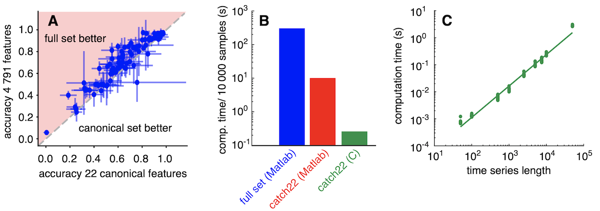

# _catch22_ - CAnonical Time-series CHaracteristics

## About

_catch22_ is a collection of 22 time-series features coded in C that can be run from Python, R, Matlab, and Julia.
The _catch22_ features are a high-performing subset of the over 7000 features in [_hctsa_](https://github.com/benfulcher/hctsa).

Features were selected based on their classification performance across a collection of 93 real-world time-series classification problems, as described in our open-access paper:
- [&#x1F4D7; Lubba et al. (2019). _catch22_: CAnonical Time-series CHaracteristics](https://doi.org/10.1007/s10618-019-00647-x).

_But what do the features do?_
You can learn more about what each feature does, with visualizations of how the features behave on real data, [here](https://feature-based-time-series-analys.gitbook.io/catch22-features/).

The computational pipeline used to generate the _catch22_ feature set is in the [`op_importance`](https://github.com/chlubba/op_importance) repository.

For _catch22_-related information and resources, including a list of publications using _catch22_, see the [___catch22_ wiki__](https://github.com/DynamicsAndNeuralSystems/catch22/wiki).

Summary of the performance of the _catch22_ feature set across 93 classification problems, and a comparison to the [_hctsa_ feature set](https://github.com/benfulcher/hctsa) (cf. Fig. 4 from [our paper](https://doi.org/10.1007/s10618-019-00647-x)):

## Installation: Python, R, Matlab, Julia, and compiled C

There are native versions of this code for other programming languages:

- [Rcatch22](https://github.com/hendersontrent/Rcatch22) (R) `install.packages("Rcatch22")`
- [pycatch22](https://github.com/DynamicsAndNeuralSystems/pycatch22) (python) `pip install pycatch22`
- [Catch22.jl](https://github.com/brendanjohnharris/Catch22.jl) (Julia) `Pkg.add("Catch22")`

You can also use the C-compiled features directly or in Matlab, following the [detailed installation instructions on the wiki](https://github.com/DynamicsAndNeuralSystems/catch22/wiki/Installation-and-Testing).

## Important Notes

- When presenting results using _catch22_, you must identify the version used to allow clear reproduction of your results. For example, `CO_f1ecac` was altered from an integer-valued output to a linearly interpolated real-valued output from v0.3.
- _catch22_ features only evaluate _dynamical_ properties of time series and do not respond to basic differences in the location (e.g., mean) or spread (e.g., variance).
- If the location and spread of the raw time-series distribution may be important for your application, you should apply the function argument `catch24 = true` (`TRUE` in R, `True` in Python) to your call to the _catch22_ function in the language of your choice. This will result in 24 features being calculated: the _catch22_ features in addition to mean and standard deviation.
- Time series are _z_-scored internally (for features other than mean and standard deviation), which means that, e.g., constant time series will lead to `NaN` outputs.
- Time-series data are taken as an ordered sequence of values (without time stamps). We assume an evenly sampled time series.
- See language-specific usage information in the [wiki](https://github.com/DynamicsAndNeuralSystems/catch22/wiki/Installation-and-Testing).
